# Luồng Workflow

## Luồng tổng quan

```mermaid
flowchart LR
  Lead["Lead/Customer/Project"] --> Q["Báo giá"]
  Q -->|Admin ký duyệt| QS["Báo giá đã gửi"]
  QS -->|Khách xem/ký| QA["Báo giá accepted"]
  QA --> C["Tạo hợp đồng"]
  QA --> I1["Tạo hóa đơn trực tiếp"]
  C -->|Admin ký duyệt| CS["Hợp đồng đã gửi"]
  CS -->|Khách ký| CA["Hợp đồng đã ký"]
  CA --> I2["Tạo hóa đơn"]
  I1 --> IS["Admin ký duyệt hóa đơn"]
  I2 --> IS
  IS -->|Khách ký/xác nhận| IA["Hóa đơn đã xác nhận"]
  IA --> P["Ghi nhận thanh toán"]
  P --> R["Phiếu thu + cập nhật invoice status"]
```

## 1. Tạo báo giá

Nguồn:

- `app/Models/Quotation.php`
- `modules/Finance/Filament/Resources/Quotations`

Khi tạo:

- Sinh `hash` public link.
- Sinh mã `number`.
- Gắn customer hoặc lead.
- Gắn project nếu có.
- Gắn admin phụ trách.
- Nhập item, thuế, giảm giá, tổng tiền.

## 2. Admin ký duyệt báo giá

Nguồn:

- `modules/Finance/Filament/Resources/Quotations/Pages/EditQuotation.php`

Action `adminSign`:

- Set `admin_signed_at = now()`.
- Set `status = sent`.
- Lấy email từ customer hoặc lead.
- Parse template `quotation_sign_request_sent`.
- Gửi email báo giá cho khách.
- Nếu không có email, báo warning để admin bổ sung.

Ý nghĩa workflow:

- Tài liệu chưa được gửi cho khách nếu admin chưa ký duyệt.
- Nút gửi báo giá bị disabled khi `admin_signed_at` rỗng.

## 3. Khách mở báo giá

Nguồn:

- `app/Http/Controllers/PublicQuotationController.php`

Route:

- `GET /view/quotation/{hash}`

Khi khách mở:

- Load quotation theo `hash`.
- Render HTML bằng `QuotationPdfService::renderHtml`.
- Nếu session chưa có `viewed_quotation_{hash}`:
  - Ghi session đã xem.
  - Gửi notification database cho admin.

## 4. Khách ký báo giá

Route:

- `POST /view/quotation/{hash}/sign`

Khi ký:

- Validate `signature` required.
- Cập nhật:
  - `signature`
  - `signed_at`
  - `signed_ip`
  - `signed_user_agent`
  - `status = accepted`
- Gửi notification cho admin.

Lưu ý:

- Source có service `SignedDocumentMailService::quotationAccepted`, nhưng trong `PublicQuotationController` hiện không gọi service này. Nếu port sang Workspace, nên gọi để gửi email xác nhận cho khách và nội bộ.

## 5. Tạo hợp đồng từ báo giá

Nguồn:

- `modules/Finance/Filament/Resources/Quotations/Pages/EditQuotation.php`

Action `convertToContract`:

- Chỉ hiện nếu chưa có contract theo subject chứa mã báo giá.
- Sinh mã hợp đồng bằng `Contract::nextCode()`.
- Tạo contract:
  - `subject = {code} - Hợp đồng theo Báo giá {prefix}{number}`
  - copy `customer_id`, `project_id`, `admin_id`
  - `contract_value = quotation.total`
  - `payment_channels = ['company']`
  - `content` ghi nguồn từ báo giá
- Copy item từ quotation sang contract item.
- Redirect sang trang edit contract.

## 6. Tạo hóa đơn trực tiếp từ báo giá

Nguồn:

- `modules/Finance/Filament/Resources/Quotations/Pages/EditQuotation.php`

Action `convertToInvoice`:

- Chỉ hiện nếu chưa có invoice có `clientnote` chứa mã báo giá.
- Sinh invoice prefix `HD-`.
- Tạo invoice:
  - `customer_id`, `project_id`, `admin_id`
  - `date = now()`
  - `duedate = now() + 7 ngày`
  - copy total/subtotal/tax/currency
  - `status = unpaid`
  - `payment_channels = ['company']`
  - `clientnote = Hóa đơn được tạo từ Báo giá ...`
- Copy item từ quotation sang invoice item.
- Redirect sang edit invoice.

## 7. Admin ký duyệt hợp đồng

Nguồn:

- `modules/Finance/Filament/Resources/Contracts/Pages/EditContract.php`

Action `adminSign`:

- Set `admin_signed_at = now()`.
- Gán `admin_id` nếu thiếu.
- Nếu status đang `draft`, đổi thành `sent`.
- Nếu customer có email, gửi `SendContractMail`.

Nút gửi hợp đồng cũng bị disabled nếu chưa có `admin_signed_at`.

## 8. Khách xem/ký hợp đồng

Nguồn:

- `app/Http/Controllers/PublicContractController.php`

Routes:

- `GET /view/contract/{hash}`
- `POST /view/contract/{hash}/sign`

Khi khách mở:

- Render HTML hợp đồng bằng `ContractPdfService::renderHtml`.
- Gửi notification cho admin lần đầu xem trong session.

Khi khách ký:

- Lưu `signature`, `signed_at`, `signed_ip`.
- Nếu trước đó chưa ký, gọi `SignedDocumentMailService::contractSigned`.
- Gửi notification cho admin.
- Tự động tạo hóa đơn tổng nếu hợp đồng không có payment installments.
- Nếu có invoice mới:
  - Copy items từ contract sang invoice.
  - Nếu hợp đồng có payment installments, copy sang invoice installments.

## 9. Tạo hóa đơn từ hợp đồng

Nguồn:

- `modules/Finance/Filament/Resources/Contracts/Pages/EditContract.php`

Action `convertToInvoice`:

- Chỉ hiện nếu chưa có invoice theo contract.
- Tạo invoice prefix `HD-`.
- `duedate = now() + 7 ngày`.
- `status = unpaid`.
- Copy items từ contract.
- Nếu không có item, tạo item mặc định “Thanh toán theo Hợp đồng”.
- Copy payment installments nếu có.

## 10. Admin ký duyệt hóa đơn

Nguồn:

- `modules/Finance/Filament/Resources/Invoices/Pages/EditInvoice.php`

Action `adminSign`:

- Set `admin_signed_at = now()`.
- Gán `admin_id` nếu thiếu.
- Nếu customer có email:
  - Parse template `invoice_sign_request_sent`.
  - Gửi `SendInvoiceMail`.
  - Dùng `MailOnce` để chặn gửi trùng trong 20 giây.

Nút gửi hóa đơn bị disabled nếu chưa admin ký duyệt.

## 11. Khách xem/ký hóa đơn

Nguồn:

- `app/Http/Controllers/PublicInvoiceController.php`

Routes:

- `GET /view/invoice/{hash}`
- `POST /view/invoice/{hash}/sign`

Khi khách mở:

- Render HTML hóa đơn bằng `InvoicePdfService::renderHtml`.
- Gửi notification cho admin lần đầu xem.

Khi khách ký:

- Lưu `signature`, `signed_at`, `signed_ip`.
- Nếu chưa ký trước đó, gọi `SignedDocumentMailService::invoiceSigned`.
- Gửi notification admin.

## 12. Ghi nhận thanh toán

Nguồn:

- `modules/Finance/Filament/Resources/Invoices/Pages/EditInvoice.php`
- `modules/Finance/Filament/Resources/Payments/Pages/CreatePayment.php`
- `app/Models/Payment.php`

Từ invoice action `markAsPaid`:

- Form nhập:
  - `amount`
  - `paymentmode`: bank/cash
  - `note`
- Tạo payment:
  - `invoice_id`
  - `amount`
  - `paymentmode`
  - `date`
  - `transactionid`
  - `note`
- Gửi email xác nhận cho customer nếu không bị `suppress_automatic_emails`.
- Gửi email báo có tiền cho staff/admin/project manager.
- Payment saved sẽ tự gọi `updateInvoiceStatus`.

Invoice status sau payment:

- Tổng paid = 0 -> `unpaid`
- Tổng paid > 0 và < total -> `partially_paid`
- Tổng paid >= total -> `paid`

## 13. Phiếu thu

Nguồn:

- `app/Http/Controllers/PublicPaymentController.php`
- `modules/Finance/Filament/Resources/Payments/Pages/EditPayment.php`

Routes:

- `GET /view/payment/{payment}`
- `GET /view/payment/{payment}/pdf`

Action:

- Copy link phiếu thu.
- Xem link.
- Gửi phiếu thu.
- Tải PDF.

## Workflow cần đưa vào Ong Vàng Workspace

Ưu tiên implement:

1. Quotation CRUD + items + totals.
2. Admin approve quotation + send email.
3. Public quotation view/sign.
4. Convert quotation to contract/invoice.
5. Contract approve/send/sign.
6. Invoice approve/send/sign.
7. Payment create + invoice status sync.
8. Email templates + email logs.
9. Public link token + PDF.
